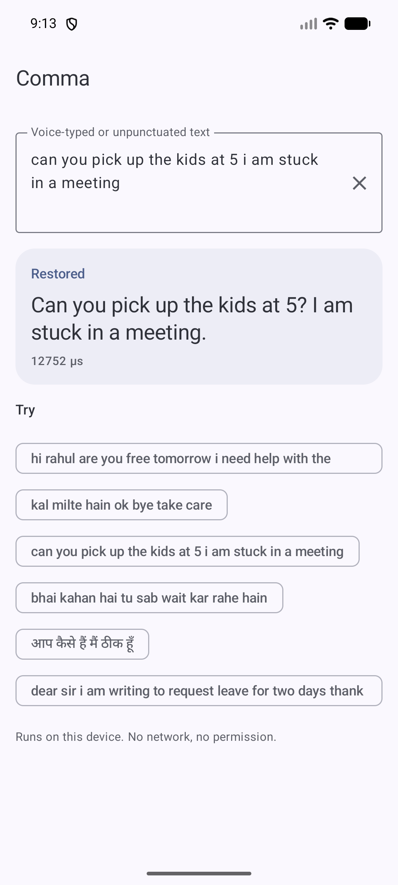
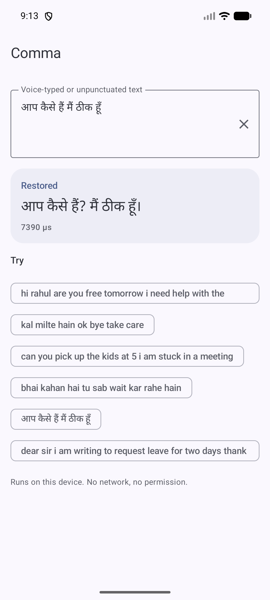
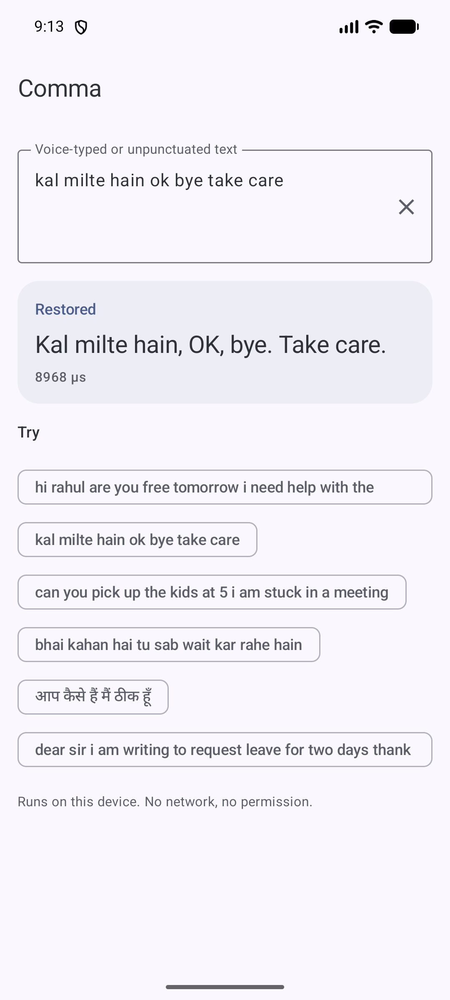
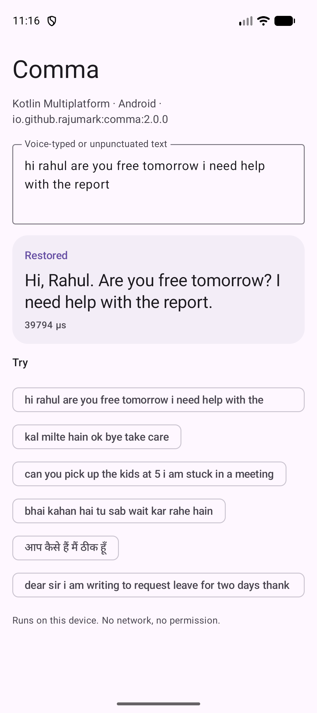
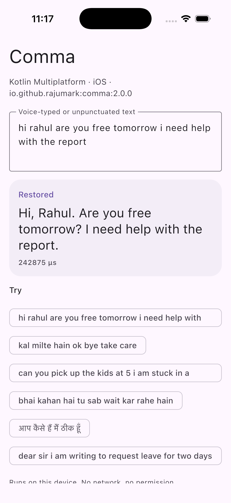
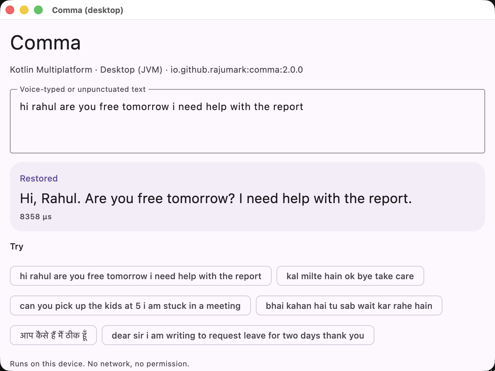
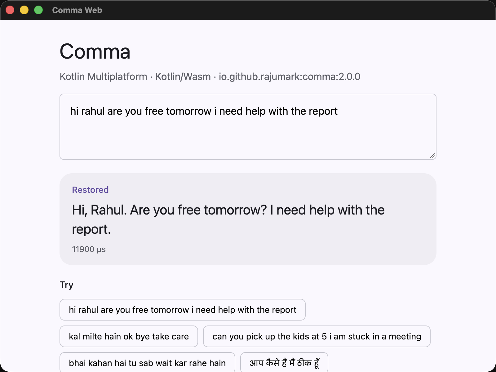

# Comma ✍️

**[Website](https://rajumark.github.io/comma/)** · **[All Hoverfly models](https://rajumark.github.io/hoverfly/#models)** · [Maven Central](https://central.sonatype.com/artifact/io.github.rajumark/comma)

By [Hoverfly](https://rajumark.github.io/hoverfly/). On-device punctuation and capitalisation for **Kotlin Multiplatform**: Android, iOS, macOS, JVM desktop, JavaScript and WebAssembly. It turns voice-typed or unpunctuated text into
readable sentences: commas, full stops, question marks, exclamation marks and capitals.

```kotlin
import io.github.rajumark.hoverfly.comma.Comma

Comma().use { comma ->
    comma.restore("can you pick up the kids at 5 i am stuck in a meeting")
    // "Can you pick up the kids at 5? I am stuck in a meeting."
    comma.restore("आप कैसे हैं मैं ठीक हूँ")
    // "आप कैसे हैं? मैं ठीक हूँ।"
}
```

- **Made for Indian text.** English, Hinglish and Tanglish chat, Hindi, Bengali, Marathi, Gujarati, Punjabi, Tamil,
  Telugu, Kannada, Malayalam and Urdu, plus Spanish, French, German, Portuguese, Italian, Russian and Indonesian.
- **Each script's own marks.** A full stop is `।` in Hindi, Marathi, Bengali and Punjabi and `۔` in Urdu; Urdu
  questions end in `؟`.
- **No dependencies.** Inference is plain Kotlin. There is no ONNX Runtime, TFLite, ML Kit or native code.
- **Private and offline.** The model ships inside the library on every platform. There is no network, no permission and no telemetry.
- **Fast enough for every message.** About 10 ms per message on an Android emulator; the model loads in about 250 ms.
- **Every platform, same results.** Android, iOS, macOS, JVM desktop, JavaScript and WebAssembly, tested against the reference model on each.

## Install

```kotlin
// build.gradle.kts: commonMain, or any platform source set
dependencies {
    implementation("io.github.rajumark:comma:2.0.0")
}
```

It's on Maven Central, so no extra repository is needed. Gradle picks the right artifact for each platform:

| Platform | Artifact |
|---|---|
| Android (minSdk 21) | `comma-android` |
| JVM desktop (Java 8+) | `comma-jvm` |
| iOS device and simulator (arm64) | `comma-iosarm64`, `comma-iossimulatorarm64` |
| macOS (arm64) | `comma-macosarm64` |
| JavaScript (browser, Node) | `comma-js` |
| WebAssembly (browser, Node) | `comma-wasm-js` |

The Android-only 1.x releases are on JitPack: `com.github.rajumark:comma:v1.x`.

Upgrading from 1.x on Android: `Comma(context)` still compiles in Kotlin (deprecated). The model no longer needs a `Context`, so switch to `Comma()`. Java code must change `new Comma(context)` to `new Comma()`.

## Screenshots

The sample app on an emulator. Every result is computed on the device.

| English | Hindi | Hinglish |
|---|---|---|
|  |  |  |
| "Can you pick up the kids at 5? I am stuck in a meeting." | "आप कैसे हैं? मैं ठीक हूँ।" | "Kal milte hain, OK, bye. Take care." |

The KMP sample on each platform:

| Android | iOS | Desktop | Web (Wasm) |
|---|---|---|---|
|  |  |  |  |

## Use

```kotlin
val comma = Comma()        // loads the model: do it off the main thread, keep one instance

comma.restore("hi rahul are you free tomorrow i need help with the report")
// "Hi, Rahul. Are you free tomorrow? I need help with the report."

comma.restore("OK, bye!!! take care...")   // existing punctuation is replaced, the text re-cased
comma.restore("   ")                        // ""

comma.close()                     // frees the model's memory
```

`restore()` is thread-safe. Long text (a whole voice note) is handled in overlapping windows, so every word gets
context on both sides.

With coroutines:

```kotlin
val comma = withContext(Dispatchers.Default) { Comma() }
val text = withContext(Dispatchers.Default) { comma.restore(transcript) }
```

From Java:

```java
try (Comma comma = new Comma()) {
    String text = comma.restore("kal milte hain ok bye take care");
}
```

### API

| | |
|---|---|
| `Comma()` | Loads the bundled model. `AutoCloseable`. |
| `restore(text)` | Returns the text with punctuation and capitals restored. `""` for blank text. |

## Quality

Word-level F1 for the four marks (punctuation) and for capitalised words (capitals), measured on held-out test sets
never used for training, and on 70 hand-written messages in 15 languages.

| | Comma | XLM-R punctuation + true-case (47 languages) | XLM-R base, punctuation only |
|---|---|---|---|
| Hinglish chat, punctuation / capitals | **0.83 / 0.92** | 0.49 / 0.70 | 0.41 / — |
| English chat, punctuation / capitals | **0.86 / 0.96** | 0.72 / 0.91 | 0.75 / — |
| Hand-written messages, punctuation / capitals | **0.74 / 0.89** | 0.70 / 0.75 | 0.69 / — |
| Hand-written messages fully right | **43%** | 26% | — |
| Formal text, 18 languages, punctuation / capitals | 0.65 / **0.79** | **0.76** / 0.66 | 0.73 / — |
| Size | **7.8 MB** | 1.1 GB | 1.1 GB |
| Latency, one message, 1 CPU thread (laptop) | **~0.3 ms** | ~39 ms | ~22 ms |

Comma is clearly better on chat and messages, and capitalises better everywhere. On long formal text (news,
encyclopedia prose) the much larger XLM-R models place commas better.

**Where it falls short:** commas in long formal sentences; "!" vs "." is a judgement call it sometimes gets
differently; some Kannada and Malayalam answers after a question also get a "?". Chinese, Japanese and Thai are not
supported (they don't separate words with spaces).

## Sample apps

`sample/` is a separate Gradle build that uses the **published** library, never the source. It resolves `io.github.rajumark` only from Maven Local, or from Maven Central with `-PcommaRepo=central`. It has a Compose Multiplatform app for Android, desktop and iOS, and a web page built for both Kotlin/JS and Kotlin/Wasm.

```bash
./gradlew :comma:publishToMavenLocal
cd sample
./gradlew :androidApp:installRelease
./gradlew :desktopApp:run
./gradlew :webApp:wasmJsBrowserDevelopmentRun     # or :webApp:jsBrowserDevelopmentRun
open iosApp/iosApp.xcodeproj                       # run the iosApp scheme on a simulator
```

## Project layout

```
comma/                         the library
  src/commonMain/              public API (Comma) and the model in plain Kotlin
                               (internal/: Text (words + rendering), Featurizer, SentencePiece, Network, UnicodeTables)
  src/{jvm,android,apple,js,wasmJs}Main/   the only platform code: NFKC normalization + model loading
  src/modelData/               comma.bin (int8 weights) · spm_pieces.tsv (tokenizer)
  src/commonTest/              parity with the reference on 94 vectors, API, latency; runs on every target
  src/jvmTest/                 checks the hand-written text rules against the 1.x java.util.regex version
sample/                        demo apps using the published artifacts
scripts/GenTables.java         generates UnicodeTables.kt (character classes) so every platform agrees
docs/                          website (rajumark.github.io/comma)
```

On JVM and Android the model ships as Java resources in the jar/AAR. Kotlin/Native and the web have no resources, so the build compiles it into the library (`generateEmbeddedModel`).

## Tests

```bash
./gradlew :comma:jvmTest
./gradlew :comma:testAndroidHostTest
./gradlew :comma:connectedAndroidDeviceTest              # on a connected device/emulator
./gradlew :comma:iosSimulatorArm64Test
./gradlew :comma:macosArm64Test
./gradlew :comma:jsNodeTest :comma:jsBrowserTest
./gradlew :comma:wasmJsNodeTest :comma:wasmJsBrowserTest
```

The parity tests require the same words, the same punctuation and case labels and the same rendered text as the reference implementation on all 94 vectors, on every target. A JVM test also compares the hand-written text rules with the 1.x java.util.regex version on 300,000 random strings.

## How it works

Every word is split into SentencePiece tokens, and each token also carries a hash of its whole word. A small
bidirectional transformer (4 layers, 7M parameters, int8 weights with one scale per row) reads the text and predicts,
for each word, the mark after it and its casing. Long text is cut into overlapping windows of 128 tokens.

## Publishing

See [PUBLISHING.md](PUBLISHING.md).

## More Hoverfly models

Comma is one of eight small on-device models by [Hoverfly](https://rajumark.github.io/hoverfly/), all with the same install, the same free tier and nothing sent to a server.

| Model | What it does | Source |
|---|---|---|
| 🙂 [Moji](https://rajumark.github.io/moji/) | Emoji suggestions in 22+ languages | [GitHub](https://github.com/rajumark/moji) |
| 🗼 [Beacon](https://rajumark.github.io/beacon/) | Language and script detection, Hinglish included | [GitHub](https://github.com/rajumark/beacon) |
| 💬 [Comeback](https://rajumark.github.io/comeback/) | Smart replies to tap | [GitHub](https://github.com/rajumark/comeback) |
| 😊 [Emotion](https://rajumark.github.io/emotion/) | 28 emotions and an overall mood per message | [GitHub](https://github.com/rajumark/emotion) |
| 🛡️ [Gatekeeper](https://rajumark.github.io/gatekeeper/) | Toxic message detection for Indian chat | [GitHub](https://github.com/rajumark/gatekeeper) |
| 🏚️ [Hideout](https://rajumark.github.io/hideout/) | Finds and hides phone numbers, UPI, Aadhaar and more | [GitHub](https://github.com/rajumark/hideout) |
| 🖍️ [Chalk](https://rajumark.github.io/chalk/) | Doodle recognition, 345 things from pen strokes | [GitHub](https://github.com/rajumark/chalk) |

See them all on the [Hoverfly website](https://rajumark.github.io/hoverfly/#models).

## Pricing & license

**Free for up to 10,000 monthly active devices.** You don't need an API key, an account or a license file: add the dependency and ship. It works in commercial apps too, with no limit on how often each device runs it.

| | Community | Commercial | Custom models |
|---|---|---|---|
| **Price** | Free | Contact us | Contact us |
| **For** | Products with up to 10,000 monthly active devices per platform | Products above 10,000 monthly active devices on any platform | A model trained for your own language, domain or task |
| **Includes** | Commercial use, unlimited calls, no key or sign-up | One license per product per model, direct support, early access to updates | Designed and trained by Hoverfly, shipped as a plain Kotlin library |

**How devices are counted.** A monthly active device is a device that runs Comma at least once in a calendar month. The limit applies separately to each product, each platform (Android, iOS, web…) and each Hoverfly model. Once a product passes it, you have 30 days to get a commercial license. The library keeps working and never checks in with a server.

**Not allowed** under any tier (unless agreed in writing):

- selling or redistributing Comma or its model on its own, or inside another SDK or library
- extracting, modifying, fine-tuning or retraining the model weights
- using the model or its outputs to train or distill another model
- reverse engineering the model or its file format
- offering it as a hosted API for others

**Custom models.** Hoverfly also designs and trains small, fast on-device models for your needs: punctuation, moderation, classification, language detection, smart replies and more.

**Contact** for a commercial license or a custom model: [raju348636@gmail.com](mailto:raju348636@gmail.com) or **+91 63533 21951** (call or WhatsApp).

Full terms: [Hoverfly Community License](LICENSE).
